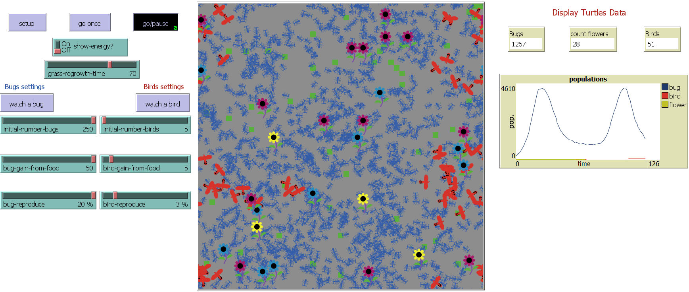
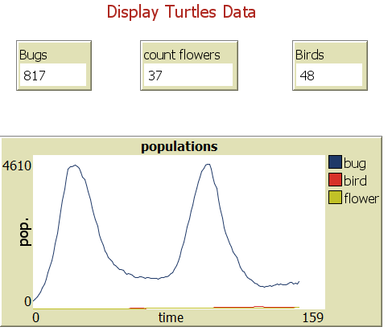
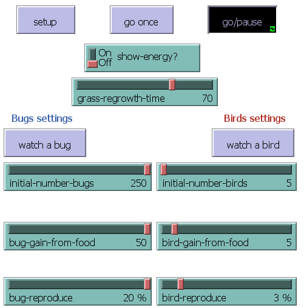
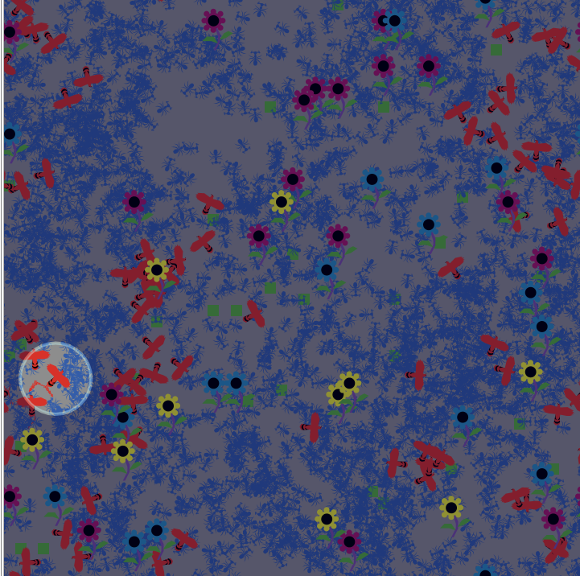
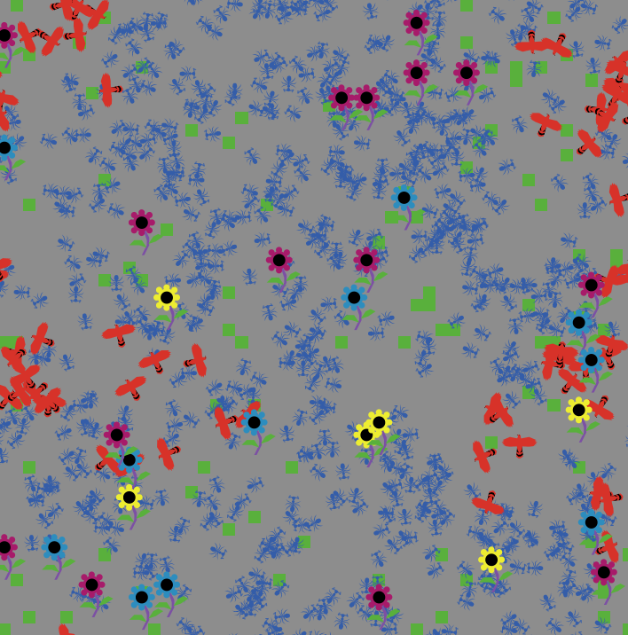

## Program 01 - Food Chain

### Loic Konan

### Instructions

- Need to have at ***least 6.2.0 NetLogo*** version intall to run the Project #1.

### Description

A **Food Chain Ecosystem** that make it easy to visualize the relationship between the Agents and their life span.

- In this ecosystem the bugs and birds are the agents.
- The grass is the environment.
- For the interaction we have:
  - the bugs eat the grass
  - the birds eat the bugs
  - One unit of energy is deducted for every step that each Agent takes.

**A system is called unstable if it tends to result in the extinction of one or more species involved or it is called stable if it maintains itself over time.**

***Description of the model:***

- **Birds and Bugs** wander randomly around the landscape.
- Each step costs the Bugs and the Birds **energy**.
- Each Agent / Turtles must eat in order to **replenish their energy**.
- When they run out of energy they **die**.
- Once the grass is eaten it will only regrow after a **fixed amount of time**.
- The Reproductions of the Agents was created using a **fixed probability method**.
- The Flowers are just for **decoration**.

***Adjusting the slider parameters***

- **INITIAL-NUMBER-BUGS:** The initial number of the BUGS population
- **INITIAL-NUMBER-BIRDS:** The initial number of the BIRDS population
- **BUGS-GAIN-FROM-FOOD:** The amount of energy BUGS gets for every grass eaten
- **BIRDS-GAIN-FROM-FOOD:** The amount of energy BIRDS gets for every BUGS eaten
- **BUGS-REPRODUCE:** The probability of a BUGS reproducing at each time step
- **BIRDS-REPRODUCE:** The probability of a BIRDS reproducing at each time step
- **GRASS-REGROWTH-TIME:** How long it takes for grass to regrow once it is eaten.
- **SHOW-ENERGY?:** Whether or not to show the energy of each animal as a number

There are ***3 monitors*** to show the populations of:

1. Birds
2. Bugs
3. Flowers
And The **populations plot** displays the population values over time.

            