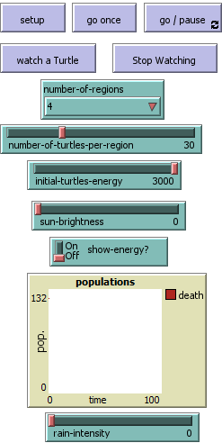
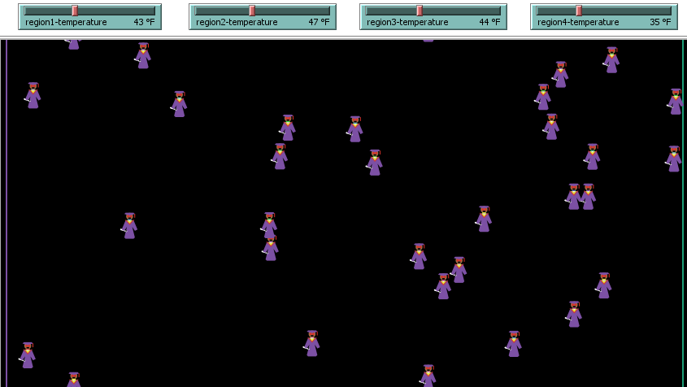

## Program 02 - Hot Spots Model

### Loic Konan

### Instructions

• Need to have at least ***6.2.0 NetLogo*** version intall to run the Project #2.

### Description

❖ This is a model that shows how to divide the world in regions, and keep different turtles confined to the region they start in. 
❖ It also shows how each turtle react to different temperatures. 

- **agents** are ***BIRDS, HUMANS, BEES, FISH***.
- we have different **environment** different colors.
- For the **interaction**, each agent just moves randomly, then lose energy when they move.

• The world is separated in regions divided by vertical lines. 
• When a turtle reaches the left or right boundary of a region, it crosses to the other side. 
• Turtles move fast depending on how hot the temperature is or other parameters in the interface. 
• Each turtle lose energy when they move so the faster they move the more energy they lose. 
• when the turtle run out of energy they die. 

**The Buttons**

Choose the **NUMBER-OF-REGIONS**, the **NUMBER-OF-TURTLES-PER-REGION**, the **INITIAL-TURTLE-ENERGY**, and decide how hot you want to make a particular region that you want, click **SETUP**, and then **GO**.

• Press the **SETUP** button. 
• Press the **GO** button to begin the simulation and to run forever until the model stop. 
• Press the **GO** button again to Pause to the simulation. 
• Press the **GO ONCE** button to advance the model by one tick (time step) unlike the Go button that run forever. 
• Look at the **Monitor** to see the **death** toll. 
• Press the **watch a turtle** button to see the path of that specific turtle until it dies. 
• Press the **stop watching** to erase that path created previously. 

**Adjusting the slider parameters**
• **INITIAL-TURTLE-ENERGY** the energy of each Agents to start the model. 
• **NUMBER-OF-TURTLES-PER-REGION:** The initial number of the turtle population in each region. 
• **NUMBER-OF-REGIONS:** the number of regions to look at. 
• **REGION#-TEMPERATURE** the temperature of each region.(parameter that the user can set) that will affect how fast the agents move. 
• **SUN-BRIGHTNESS:** to set how hot the sun is and make the agents move faster. 
• **SHOW-ENERGY?:** Whether or not to show the energy. 

