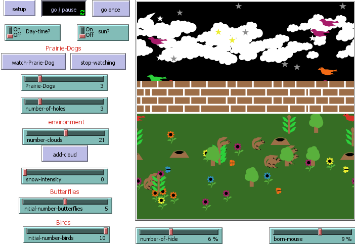
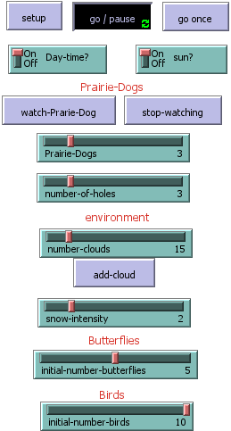
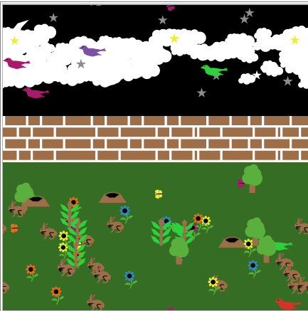
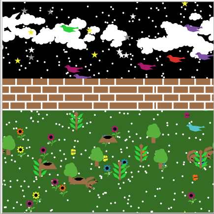
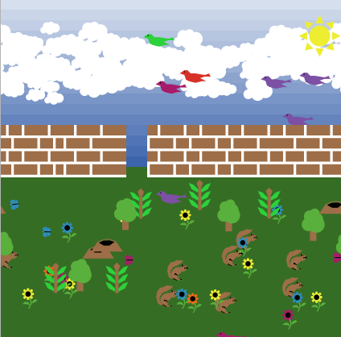
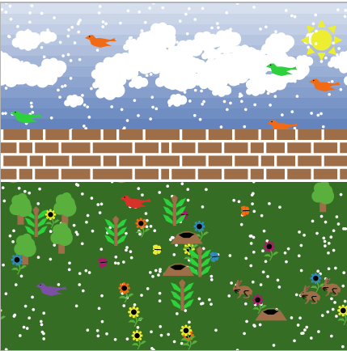

## Program 03 - Prairie Dogs Model

### Loic Konan

### Instructions

• Need to have at least ***6.2.0 NetLogo*** version intall to run the Project #3.

### Description

This model Simulate a prairie dog habitat.

1. In this ecosystem the Prairie Dogs, Butterflies and Birds are the **agents**.
2. The grass, sky is the **environment**.
3. For the interaction we have:
   - The Prairie Dogs make an alarm and run around the landscape to go hide in their holes.

• **Birds and Butterflies** and Prairie Dogs** wander randomly around the landscape. 
• When the mouse is down the Prairie dogs make an alarm and they go hide. 

**The Buttons**

1. Press the **SETUP** button.
2. Press the **GO** button to begin the simulation and to run forever until the model stop.
3. Press the **GO** button again to Pause to the simulation.
4. Press the **GO ONCE** button to advance the model by one tick (time step) unlike the Go button that run forever.
5. Press the **watch a Prairie Dog** button to see the path of that specific prairie dog
6. Press the **stop watching** button to stop watching the one Prairie dog.

**Adjusting the slider parameters**
• **Prairie Dogs:** The initial number of the ***Prairie Dogs population***. 
• **INITIAL-NUMBER-BIRDS:** The initial number of the ***BIRDS population***. 
• **INITIAL-NUMBER-BUTTERFLIES:** The initial number of the BUTTERFLIES population. 
• **DAY-TIME?:** This switch makes it a daytime, or it will display the night time. 
• **SUN?:** This switch asks if sun? if not it will display the moon with few stars. 
• **NUMBER-OF-HOLES:** The number of holes for the Prairie dogs. 
• **SNOW-INTENSITY:** How much snow you want to fall from the sky. 
• **ADD-CLOUD:** This one is a butter that Make few clouds and make them move left to right. 

   
   