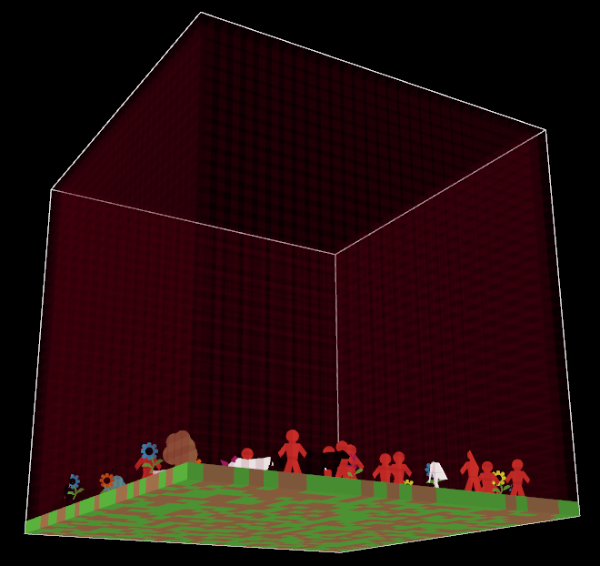

## Program 04 - 3D Food Chanin Ecosystem

### Loic Konan

### Instructions

• Need to have at least ***NetLogo 3D 6.2.0*** version intall to run the Project #4.

### Description

This is a **3D model** that explores a **Food Chain ecosystem**.

1. In this ecosystem the people and cows are the **agents**.
2. The grass is the **environment**.
3. For the **interaction** we have:
o the cows eat the grass. 
o the people eat the cows. 

• **people and cows** wander randomly around the landscape. 
• Each step costs the **cows** and each **person some energy**. 
• Each **Agent / Turtles** must **eat** in order to replenish their **energy**. 
• When they run out of energy they **die**. 
• Once the **grass is eaten** it will only **regrow** after a **fixed amount of time**. 
• The **Reproductions** of the **Agents** was created using a fixed probability method. 

- ***One unit of energy is deducted for every step that each Agent takes.*** 

**The Buttons**

1. Press the **SETUP** button.
2. Press the **GO** button to begin the simulation and to run forever until the model stop.
3. Press the **GO** button again to Pause to the simulation.
4. Press the **GO ONCE** button to advance the model by one tick (time step) unlike the Go button that run forever.
5. Look at the **monitors** to see the current population sizes
6. Look at the **POPULATIONS** plot to watch the populations fluctuate over time.
7. Press the **watch a cow’s** button to see the path of that specific cow until it dies.
8. Press the **watch a person** button to see the path of that specific person until it dies.
9. **Side-view** help you see from the side
10. **Top view** help you see form the top
11. **Bottom view** help you see from the bottom.

 
 